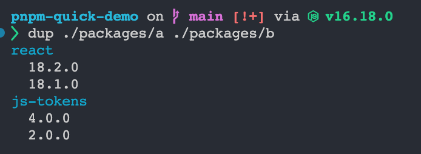

# pnpm-duplicate-view

a small tool to show duplicate dependencies in pnpm workspace

```bash
> npm install -g @nrr/pnpm-duplicate-cli
# execute in workspace-root directory
> dup ./cli ./core
```


